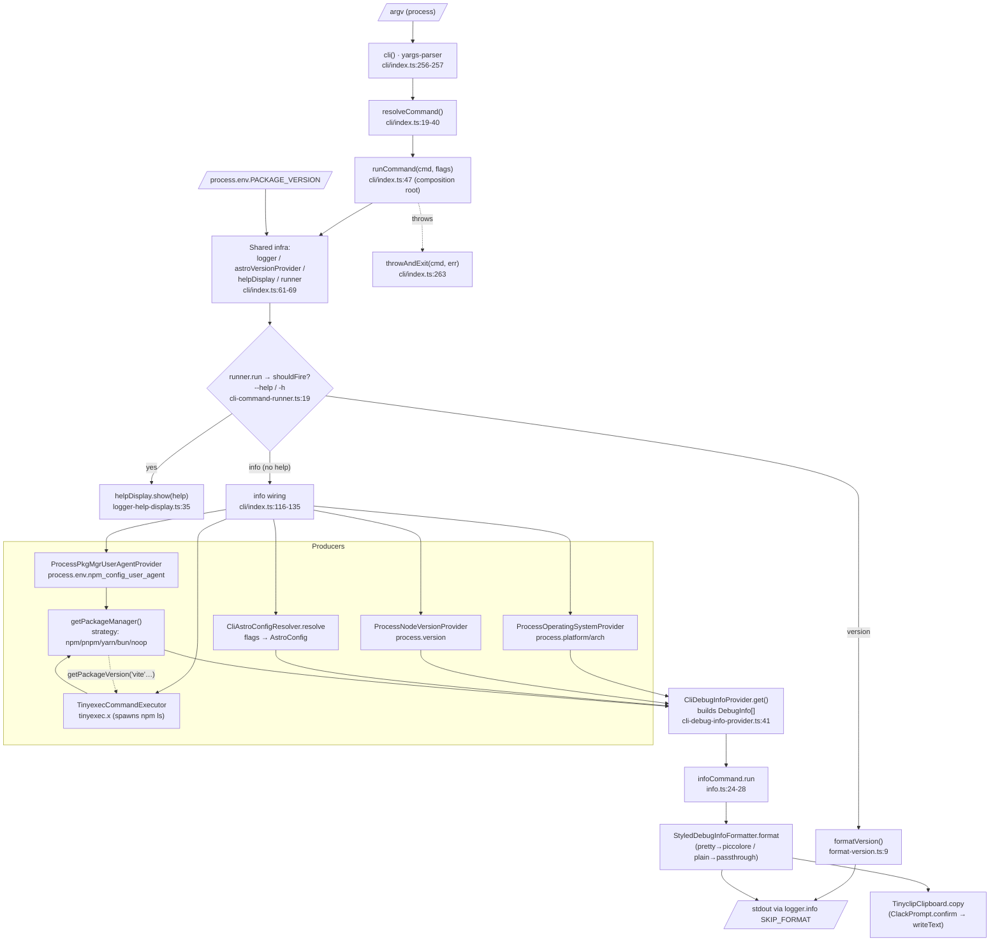

# Research: Przepływ danych w warstwie `cli/infra` (przeciek warstw) — withastro/astro

**Date**: 2026-06-30T20:49:36+0200
**Researcher**: karczynski_t
**Analyzed commit**: withastro/astro `e37dfe2a7623acd364d7e3556ecc9b31e3e45520` (HEAD klonu, 2026-06-26)
**Host branch**: main (10xDEVS @ `0332de9`)
**Repository**: `withastro/astro` — analiza na lokalnym, read-only klonie w `astro-legacy-analysis/`

> Permalink-base do referencji poniżej (ścieżki podawane względem `packages/astro/src/`):
> `https://github.com/withastro/astro/blob/e37dfe2a7623acd364d7e3556ecc9b31e3e45520/packages/astro/src/<plik>#L<linia>`

## Research Question

Przeanalizuj przepływ danych w warstwie `cli/infra/*`, traktując `context/map/repo-map.md` jako prior. **Hipoteza do weryfikacji:** pliki pod `cli/infra/*` są realnie konsumowane **poza CLI** (przez `core/dev`, `core/preview`, `vite-plugin-app`) — czyli „CLI" to w istocie współdzielona warstwa infra; liczba „14 importów" z mapy jest niepewna (graf bez tsConfig).

Trzy filary (trzej równolegli sub-agenci): **(1) trace e2e**, **(2) luki w testach**, **(3) blast radius** (graf statyczny ∩ co-change z gita).

---

## Konwencja pewności

Każde ustalenie jest oznaczone:
- **[E] EVIDENCE** — przeczytane w kodzie/gicie, z `file:line` lub hashem commita.
- **[I] INFERENCE** — interpretacja na bazie dowodów.
- **[U] UNKNOWN** — biała plama / poza zasięgiem tej rundy.

---

## Summary (werdykt na hipotezę)

- **Hipoteza „layer leak" — POTWIERDZONA, ale mapa PRZESZACOWAŁA liczbę. [E]** `cli/infra/*` jest importowane spoza `cli/` przez **dokładnie 3 pliki**, **8 linii importu**: `core/dev/dev.ts`, `core/preview/static-preview-server.ts`, `vite-plugin-app/createAstroServerApp.ts`. Mapowe „~14 importów" jest zawyżone (graf bez tsConfig prawdopodobnie podwójnie liczył **9** dynamicznych `import('./infra/…')` w samym `cli/index.ts` — zweryfikowane ast-grep, linie 56-59,103,108,113,163,164 — plus 8 statycznych spoza CLI ≈ 17 surowych wzmianek). *Pierwotnie raport podawał 8; ast-grep+grep skorygowały na 9.*
- **Odkrycie ponad mapę: 4. sprzężenie, na seamie typów. [E]** `core/messages/runtime.ts:12` importuje **typy** `AstroVersionProvider, TextStyler` z `cli/definitions.ts` — czyli poza implementacjami przecieka też publiczny kontrakt interfejsów.
- **Dwa pliki infra NIE przeciekają. [E]** `cli-command-runner.ts` i `logger-help-display.ts` są importowane wyłącznie przez `cli/index.ts`.
- **Mapowy „refaktor CLI→DDD autorstwa Floriana Lefebvre" — POTWIERDZONY z hashami. [E]** Warstwa `cli/infra/` powstała przez *hoisting* z `cli/create-key/infra/` w `63b256839f3` (#14595, 2025-10-21).
- **Profil długu: nie render-pipeline, tylko nietestowane adaptery I/O + composition root.** Warstwa *domain/core* `info` jest dobrze pokryta (DI + fakes); realna praca (subprocess, parsowanie wyjścia package managerów, formatter, `cli/index.ts`) jest niepokryta.

---

## Weryfikacja strukturalna (ast-grep + grep) — 2026-06-30

Twierdzenia strukturalne raportu potwierdzone narzędziowo `ast-grep 0.44.0` (precyzja), każde zero kontrowane klasycznym `grep` (realny brak vs zły wzorzec). Klon: `astro-legacy-analysis @ e37dfe2a762`.

| # | Twierdzenie | Werdykt | Dowód narzędziowy |
|---|-------------|---------|-------------------|
| C1 | `cli/infra/*` poza CLI: 3 pliki / 8 importów | ✅ potwierdzone | ast-grep=8, grep=8 (identyczne); `core/dev/dev.ts:25-26`, `core/preview/static-preview-server.ts:12-13`, `vite-plugin-app/createAstroServerApp.ts:9-12` |
| C2 | Rozbicie per-symbol | ✅ potwierdzone | build-time←3, piccolore←2, passthrough/process-os/tinyexec←1, oba runnery←0 |
| C3 | `cli-command-runner` + `logger-help-display` importowane **tylko** z `cli/index.ts` | ✅ potwierdzone | grep wszystkich `.ts`: jedyne wystąpienia `cli/index.ts:59` i `:58` |
| C4 | `core/messages/runtime.ts:12` → typy z `cli/definitions.ts` | ✅ potwierdzone | ast-grep + grep: `import type { AstroVersionProvider, TextStyler }` |
| C5 | 7 implementerów (6 klas + 1 const) | ✅ potwierdzone | ast-grep `class $C implements $I`: 6 klas w `cli/infra/` + const `piccoloreTextStyler` |
| C6 | „6 interfejsów" w `definitions.ts` | 🔵 doprecyzowane | ast-grep `interface $I`: **7 deklaracji** = 6 portów + `CommandExecutorOptions` (typ-opcje, nie port) |
| C7 | Konsumenci typów: `format-version.ts` + `core/messages/runtime.ts` | ✅ potwierdzone | grep: `cli/utils/format-version.ts:1` + `core/messages/runtime.ts:12` |
| C8 | „8 dynamicznych `import()`" infra w `cli/index.ts` | 🔵 doprecyzowane | ast-grep `import($SRC)`=9 i grep=9 → **9, nie 8** (L56-59,103,108,113,163,164) |
| C9 | 5 strategii PM (npm/pnpm/yarn/bun/noop) | ✅ potwierdzone | ast-grep `case $V:` dało **0 = zły wzorzec** (brak kontekstu `switch`); grep: 4× `case` + 2× `new NoopPackageManager` |

**Bilans:** 0 obalonych, 2 doprecyzowania liczbowe (C6, C8), reszta potwierdzona. **Reguła z lekcji w akcji:** zero z ast-grep przy C9 było artefaktem wzorca, nie kodu — grep to wychwycił. Skorygowane liczby naniesione w Summary (C8: 8→9) i poniżej (C6).

---

## ① FEATURE OVERVIEW (przepływ, nie spis plików)

Feature to **kompozycja zależności CLI metodą ręcznego constructor-injection** i jej przepływ przez komendę `info` (która zużywa najwięcej infra). Seam stanowią interfejsy w `cli/definitions.ts`; `cli/infra/*` to konkretne implementacje wybierane w *composition root* (`runCommand`) przez dynamiczny `import()`. Brak kontenera DI. **[I]**

### Skąd wchodzą dane (ENTER)
**[E]** Źródła wejścia na ścieżce:
- **argv** → `cli()` parsuje `yargs-parser` w `flags` (`cli/index.ts:256-257`).
- **process.env.PACKAGE_VERSION** → `BuildTimeAstroVersionProvider` (`cli/infra/build-time-astro-version-provider.ts:5`; wstrzyknięte esbuildem przy buildzie).
- **process.platform / process.arch** → `ProcessOperatingSystemProvider` (`cli/infra/process-operating-system-provider.ts:10-11`).
- **process.version** → `ProcessNodeVersionProvider` (`cli/info/infra/process-node-version-provider.ts:4`).
- **process.env.npm_config_user_agent** → `ProcessPackageManagerUserAgentProvider` (`cli/info/infra/process-package-manager-user-agent-provider.ts:5`).
- **stdout child-processu** (`npm/pnpm/yarn ls … --json`) → przez `TinyexecCommandExecutor` (`cli/infra/tinyexec-command-executor.ts:10`).

### Kto waliduje / rozwiązuje (VALIDATE / RESOLVE)
**[E]**
- **Routing komendy**: `resolveCommand(flags)` mapuje `flags._[2]` → `CLICommand`; `flags.version` → `'version'`; nieznana → `'help'` (`cli/index.ts:19-40`).
- **Brama `--help`**: `CliCommandRunner.run` sprawdza `helpDisplay.shouldFire()` (`= !!(flags.help||flags.h)`) i albo drukuje help, albo deleguje do `command.run(...)` (`cli/infra/cli-command-runner.ts:15-24`, `cli/infra/logger-help-display.ts:31-33`). To centralna bramka — `--help` każdej komendy jest przechwytywany tutaj, przed ciałem komendy.
- **Flagi → AstroConfig**: `CliAstroConfigResolver.resolve()` mapuje `flags` na inline-config i woła `core/config` `resolveConfig(..., 'info')` (`cli/info/infra/cli-astro-config-resolver.ts:13-49`).
- **User-agent → strategia PM**: `getPackageManager()` — brak UA → `NoopPackageManager`; inaczej parsuje specyfikator i `switch` na `Pnpm/Npm/Yarn/Bun/Noop` (`cli/info/core/get-package-manager.ts:9-43`).

### Gdzie zmienia/składa się stan (STATE)
**[E]** Stan jest **składany, nie mutowany w miejscu**: `CliDebugInfoProvider.get()` buduje niezmienną tablicę `DebugInfo` (`[label,value][]`) — Astro version, Node, System, Package Manager, Output, opcjonalnie Vite (przez `packageManager.getPackageVersion('vite')`), Adapter, Integrations (`cli/info/infra/cli-debug-info-provider.ts:41-75`).
Jedyne realne efekty uboczne: **spawn `npm ls`** (granica procesu, `cli/info/infra/npm-package-manager.ts:17-42`), **zapis do schowka** (`tinyclip.writeText`), **log**.

### Co wraca (RETURN / OUTPUT)
**[E]** Dwa kanały wyjścia z `infoCommand.run` (`cli/info/core/info.ts:24-28`):
1. **stdout** — `logger.info('SKIP_FORMAT', StyledDebugInfoFormatter.format(debugInfo))` (`styled-debug-info-formatter.ts:17-32`).
2. **schowek** — `TinyclipClipboard.copy(...)` po potwierdzeniu `ClackPrompt.confirm` (`cli/info/infra/tinyclip-clipboard.ts:20-39`).
Błędy całej ścieżki spływają do `throwAndExit(cmd, err)` (`cli/index.ts:262-263`).
Najprostsze ścieżki dla kontrastu: `version` używa tylko `astroVersionProvider`+`textStyler` (`cli/index.ts:80-87`); `help` drukuje `DEFAULT_HELP_PAYLOAD` bez configu (`cli/index.ts:74-78`).

### Seam (kontrakt), który czyni producentów wymiennymi
**[E]** `cli/definitions.ts` deklaruje porty: `HelpDisplay` (:5), `TextStyler` (:10), `AstroVersionProvider` (:20), `CommandRunner` (:24), `CommandExecutor`+`CommandExecutorOptions` (:31-45), `OperatingSystemProvider` (:47). Kształt komendy: `cli/domain/command.ts:3-8` (`Command<T> = { help; run }`). Każda klasa `cli/infra/*` ma klauzulę `implements` na odpowiednim porcie.

### Diagram przepływu

---

## ② TECHNICAL DEBT (konkretne ryzyko, nie „czuły rejon")

Trzy rodzaje ryzyka, od najbardziej materialnego. Na końcu — co jest **długiem prawdziwym**, a co **tanim** (łapanym przez CI/typy/regenerację).

### A. Kruche sprzężenia (przeciek warstw)

**[E] — Przeciek implementacji `cli/infra/*` poza CLI (3 pliki, 8 importów):**

| infra file | importer poza cli (file:line) |
|---|---|
| build-time-astro-version-provider | `core/dev/dev.ts:25`, `core/preview/static-preview-server.ts:12`, `vite-plugin-app/createAstroServerApp.ts:9` |
| piccolore-text-styler | `core/dev/dev.ts:26`, `core/preview/static-preview-server.ts:13` |
| passthrough-text-styler | `vite-plugin-app/createAstroServerApp.ts:10` |
| process-operating-system-provider | `vite-plugin-app/createAstroServerApp.ts:11` |
| tinyexec-command-executor | `vite-plugin-app/createAstroServerApp.ts:12` |

**[E] — Przeciek seamu typów:** `core/messages/runtime.ts:12` importuje `AstroVersionProvider, TextStyler` z `cli/definitions.ts`.

**Ryzyko (konkretne):**
- **[I]** `core/dev`, `core/preview` i `vite-plugin-app` mają de-facto zależność od `cli/`. Refaktor „CLI" (przeniesienie/zmiana sygnatur infra) **złamie serwer dev/preview i plugin Vite środowiska** — dokładnie odwrotnie do intuicji „CLI jest na peryferiach".
- **[E]** `BuildTimeAstroVersionProvider` to najbardziej przeciekający plik (wszystkie 3 zewnętrzne pliki). Zmiana w nim ma najszerszy promień.
- **[I]** Kierunek zależności jest odwrócony względem katalogów: warstwa „aplikacyjna" (`cli`) jest importowana przez „rdzeń" (`core`). To prawdziwy strukturalny smell, nie kosmetyka.

### B. Luki testowe

**Kontekst metodyczny [E]:** klon jest **sparse checkout** — `packages/astro/test/` jest w gicie, ale **nie na dysku**; testy czytane przez `git show HEAD:…`. Runner CLI to **`node:test`+`node:assert`** na zbudowanym `dist/` (`package.json:133`), bez narzędzi coverage. (Uwaga: narzędzia patrzące tylko na working tree błędnie orzekłyby „zero testów CLI".)

**Dobrze pokryte (kredyt) [E]:** warstwa *domain/core* `info` — `getPackageManager` (6 testów, wszystkie ramiona switcha), `CliDebugInfoProvider` (5), `DevDebugInfoProvider` (4, w tym kontrakt „never fetches versions"), `CliCommandRunner` (obie gałęzie `shouldFire`), `infoCommand`. To projekt testowalny przez DI+fakes.

**Materialne luki (dług prawdziwy — typy/CI tego NIE złapią), wg ważności [E]:**
1. **`TinyexecCommandExecutor.execute()` — cała klasa, zwłaszcza catch `NonZeroExitError`** (`tinyexec-command-executor.ts:24-36`). Jedyny realny adapter subprocessu, do tego **przeciekający** (`vite-plugin-app:12`). Regresja (zła wiadomość błędu, zgubione `stderr/stdout`, złamany `instanceof` po bumpie `tinyexec`) → nieprzejrzyste błędy w dev-serwerze i `astro info/docs`, cicho. Testy podstawiają `SpyCommandExecutor` → realna klasa ma **zero** wykonania.
2. **`npm/pnpm/yarn` `getPackageVersion()` — parsowanie JSON/NDJSON** (`npm-…:17-42`, `pnpm-…:21-47`, `yarn-…:26-61`). Najbardziej podatny na błędy kod ścieżki (ręczne parsowanie 3 formatów, fallback zagnieżdżonego `astro`, pnpm `link:`→`Local`, yarn NDJSON). Zmiana formatu `--json` PM-a → `astro info` cicho raportuje złe/`undefined` wersje w bug-reportach, bez czerwonego testu.
3. **`StyledDebugInfoFormatter.format()`** (`styled-debug-info-formatter.ts:17-32`) — realne renderowanie `astro info`. Test `infoCommand` wstrzykuje **fake** formatter, brak testu integracyjnego `astro info` → padding/multi-line/`.trim()` mogą się zepsuć bez sygnału.
4. **`cli/index.ts` `resolveCommand` fallback + dyspozytor `runCommand`** (`:19-40`, `:72-199`) — composition root tego feature'a. Brak testu jednostkowego; integracja dotyka tylko `check` i gołego `astro`. `astro info` nie ma żadnego testu uruchamiającego realny wiring.
5. **`CliAstroConfigResolver.resolve()`** (`cli-astro-config-resolver.ts:13-50`) — mapowanie flag→config (m.in. `allowedHosts`). Niepokryte (sam komentarz w źródle to przyznaje).
6. **`TinyclipClipboard.copy()` catch** (`:33-38`) — niepokryta; dodatkowo dwa zielone testy wołają **realny `writeText`** (może pisać do prawdziwego schowka w CI — test smell).

### C. Blast radius (co MUSI zmienić się razem)

**[E] Zmiana wiringu DI `cli/infra`** (nowa zależność konstruktora, rename klasy, zmiana sygnatury `new X()`):
1. `cli/index.ts` (root DI; co-change 7/11 commitów).
2. 3 zewnętrzni importerzy `new`-ujący te klasy: `core/dev/dev.ts`, `core/preview/static-preview-server.ts`, `vite-plugin-app/createAstroServerApp.ts`.
3. Testy CLI: `test/units/cli/index.test.ts`, `…/utils.ts`, `…/docs.test.ts`, `test/cli.test.ts`.

**[E] Zmiana seamu `cli/definitions.ts`** (sygnatura interfejsu):
1. Wszystkich 7 implementerów `cli/infra/*`.
2. Konsumenci typów: `cli/utils/format-version.ts` **oraz** zewnętrzny `core/messages/runtime.ts`.
3. Wiring w `cli/index.ts`.

**[E] Co-change z gita** (commity dotykające `cli/infra/` + `definitions.ts`): top realnego sprzężenia — `cli/index.ts` (7), `cli/definitions.ts` (5), testy CLI (4), `core/dev/dev.ts` (4), rodzeństwo infra (4).

### Dług prawdziwy vs tani (regen/CI)

- **Prawdziwy [E/I]:** przeciek `cli/infra/*` i seamu do `core/*` + `vite-plugin-app` (odwrócona zależność); brak testów realnych adapterów I/O i composition root (pkt B1–B4). Tego nie złapie tsc ani lint — to logika i I/O.
- **Tani / ignorować [E/I]:** `pnpm-lock.yaml` (3 co-change), `CHANGELOG`, bumpy `package.json` — to `[regen]` przez release, nie ręczna edycja. Wiersze co-change `core/build/*`, `content/*`, `runtime/server/endpoint.ts`, `integrations/hooks.ts` to **artefakt jednego szerokiego commita** „remove picocolors" (`e1dd377398a`), nie strukturalne sprzężenie z seamem. Drift sygnatur na czystych typach (`definitions.ts`, `domain/command.ts`) łapie `test:types` (tsc) i lint → niski priorytet.

---

## Code References

- `cli/index.ts:256-257` — entry `cli()`, parse argv (yargs-parser)
- `cli/index.ts:19-40` — `resolveCommand()` routing + fallback `'help'`
- `cli/index.ts:47,61-69` — `runCommand` = composition root; budowa shared infra
- `cli/index.ts:88-146` — pełny wiring komendy `info`
- `cli/definitions.ts:5-51` — porty (seam) całego CLI
- `cli/domain/command.ts:3-8` — kształt `Command<T>`
- `cli/infra/cli-command-runner.ts:15-24` — brama `--help` / delegacja `command.run`
- `cli/infra/build-time-astro-version-provider.ts:5` — `process.env.PACKAGE_VERSION` (najbardziej przeciekający)
- `cli/infra/tinyexec-command-executor.ts:24-36` — catch `NonZeroExitError` (niepokryte)
- `cli/info/core/get-package-manager.ts:9-43` — strategia PM
- `cli/info/infra/cli-debug-info-provider.ts:41-75` — składanie `DebugInfo[]`
- `cli/info/core/info.ts:24-28` — dwa kanały wyjścia (stdout + schowek)
- `cli/info/infra/styled-debug-info-formatter.ts:17-32` — realne renderowanie (niepokryte)
- **Przeciek poza cli:** `core/dev/dev.ts:25-26`, `core/preview/static-preview-server.ts:12-13`, `vite-plugin-app/createAstroServerApp.ts:9-12`, `core/messages/runtime.ts:12`

## Architecture Insights

- **[I]** Wzorzec: DDD-lite per-komenda (`<cmd>/core` + `<cmd>/infra` + `<cmd>/definitions`) z hoistingiem wspólnej infra do `cli/infra` + `cli/definitions`. Composition root ręczny w `runCommand`, zależności wstrzykiwane literałami obiektów, implementacje ładowane dynamicznym `import()` (lazy, dobre dla startu CLI).
- **[E]** Geneza: `63b256839f3` (#14595, Florian Lefebvre, 2025-10-21) — utworzył `cli/definitions.ts` i `cli/infra/` przez `R100` rename z `cli/create-key/infra/`. Dalej `0d84321024f` (#14722) dodał tinyexec/OS/passthrough; `e1dd377398a` (#14813, Emanuele Stoppa) wymienił styler na piccolore (szeroki sweep).
- **[I]** Wzorzec „infra zaczęła życie w jednej komendzie (`create-key`), potem awansowała do warstwy CLI-wide" wyjaśnia, czemu przeciek wygląda na zamierzone współdzielenie utili (version/styler/exec), a nie przypadek — ale efekt to realna zależność `core→cli`.

## Historical Context (from prior changes)

- `context/map/repo-map.md` — prior tej analizy; §3 i §6 trafnie wskazały plik-przykład (`build-time-astro-version-provider.ts`) i kierunek przecieku, ale §1 zawyżyło liczbę („~14 importów" vs realne 8).
- `context/foundation/lessons.md` — wpisy dotyczą wyłącznie projektu 10xCards (Supabase/Cloudflare/Astro SSR); **żaden nie ma zastosowania** do tej analizy legacy. Brak priora do reużycia.

## Related Research

- (brak innych artefaktów research dla tej grupy `large-scale-and-legacy-code`)

## Open Questions

- **[U]** Wnętrza `throwAndExit.ts`, `help/index.ts` (`DEFAULT_HELP_PAYLOAD`) i `core/config` `resolveConfig` — referowane, nie otwarte (poza zakresem trace).
- **[U]** Runtime call-paths: kto i kiedy faktycznie *wywołuje* wstrzyknięty runner w `core/dev`/`core/preview` w trakcie życia serwera (analiza to sprzężenie import-time + commit-time, nie runtime).
- **[U]** Cross-package (`astro` ↔ `@astrojs/*`) — graf nie obejmuje innych pakietów; ewentualni konsumenci `cli/infra` spoza `packages/astro` nieznani.
- **[U]** Czy przeciek `core→cli` jest świadomą decyzją architektów (utile współdzielone) czy długiem do spłaty — wymaga pytania do Floriana Lefebvre / Emanuele Stoppa (z mapy §5).
