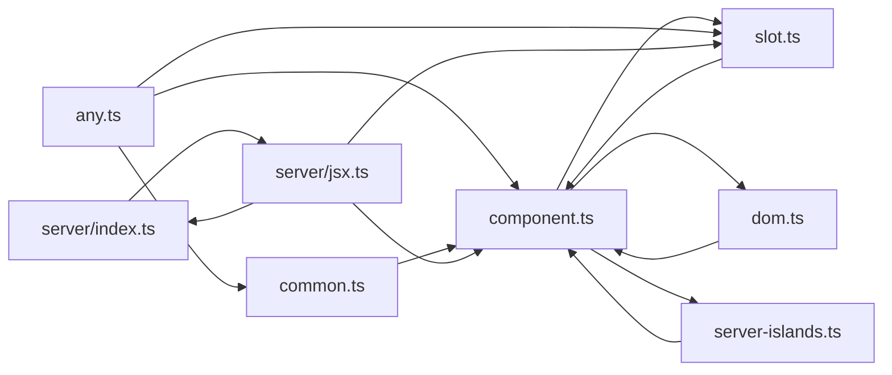

# Artefakt 2 — Struktura (withastro/astro)

**Narzędzie:** dependency-cruiser v18 (graf importów z plików źródłowych).
**Zakres:** `packages/astro/src` (sparse checkout HEAD) — **621 modułów, 1562 wewn. zależności, 65 par cykli**.
**Adaptacja:** prompt operuje ścieżkami Mattermost (`channels/src/*`, `platform/*`, `webapp`); przełożone na **aktywne obszary Astro z artefaktu 1**: `core`, `runtime`, `assets`, `cli`, `content`, `integrations/cloudflare`.
**Zastrzeżenia:** bez `tsConfig` (łańcuch `extends` poza sparse-checkoutem) → liczone importy **względne**; aliasy/type-only mogą być niedoszacowane. `.astro` poza grafem.

> Jedno zdanie: `core` jest grawitacyjnym centrum (najwyższy in-degree), dług (cykle) mieszka w `runtime/server/render`, a `cli` — wbrew historii — **nie jest czystym ujściem** (`cli/infra/*` jest reużywane przez rdzeń).

---

## 1. Rozpoznanie możliwości (strategie + raporty)

**Top 3 strategie eksploracji legacy:**
1. **Centra grafu (in-degree)** = mapa blast-radius — najczęściej importowane pliki to „bedrocky".
2. **Cykle (`no-circular`)** = lokalizator długu — kod nieizolowalny do zmiany/testu.
3. **`--focus` / `--reaches`** na podejrzanym module = analiza wpływu „co pęknie, jak to zmienię".

**Raporty (`--output-type`):** `err`/`err-html` (walidacja reguł), `json` (własne metryki), `mermaid` (diagram na GitHub), `dot`→SVG (Graphviz), `archi`/`ddot` (widok wysokopoziomowy), `text`, `metrics` (instability/fan-in-out), `baseline` (zamrożenie długu w CI).

---

## 2. Cykle w aktywnych obszarach

**Obserwacje (3–5):**
1. **65 par cykli, z czego 49 w `runtime` i 15 w `core`** — dług skupiony, nie rozlany.
2. `runtime/server/render/*` to **gniazdo wzajemnej rekurencji** (`component ↔ slot ↔ dom ↔ any ↔ server-islands`) — to rdzeń renderowania SSR.
3. W `core` cykl to **trójkąt request-lifecycle**: `base-pipeline ↔ middleware/sequence ↔ render/index`.
4. **`assets`, `cli`, `cloudflare` — praktycznie bez cykli** (≤1) — te obszary są strukturalnie czyste mimo wysokiej aktywności historycznej.
5. Granica JSX↔render: `jsx-runtime/index ↔ runtime/server/jsx`.

| Obszar | Co znalazłeś | Dowód z dependency-cruiser | Dlaczego ważne przy zmianie | Związek z `artifact-1` | Co sprawdzić dalej |
|--------|--------------|----------------------------|------------------------------|------------------------|--------------------|
| `runtime/server/render` | 49 cykli; klaster `component/slot/dom/any/server-islands` | `circular: true` na 49 krawędziach w tym katalogu | Renderu nie da się zmienić w izolacji — dotknięcie `component.ts` ciągnie sąsiadów; ryzyko regresji SSR | #2 centrum + #1 skok aktywności 26Q1–Q2 i eksplozja testów | Czy rekurencja jest zamierzona? (art. 3 — kontrybutorzy) |
| `core` (pipeline) | trójkąt `base-pipeline ↔ middleware/sequence ↔ render/index` | 15 krawędzi cyklicznych w `core` | Lifecycle żądania spleciony — zmiana middleware dotyka renderu i pipeline | `core` #1 hot; refactor handlerów #16366 (2026-05) | Czy #16366 zmniejszył, czy dołożył te cykle |
| `content` | 2 drobne cykle (`content/*`) | 2 pary cykliczne | Niski dług; bezpieczniejszy obszar | content to publiczne API (180 zmian/rok) | Można pominąć — niski priorytet |
| `i18n` | 5 cykli (poza top-aktywnymi) | 5 par | Lokalny dług, mały obszar | i18n umiarkowanie aktywny | Obserwować, nie blokuje |

*(Zgodnie z promptem: bez Graphviz/DOT na tym etapie.)*

---

## 3. Granice warstw

Reguły `forbidden` (plik `.dc-layers.cjs`) wyrażające oczekiwaną architekturę, zweryfikowane walidacją.

**Obserwacje (3–5):**
1. **Fundament jest czysty:** `core/errors|constants|path|util` **nie importuje** z warstw wyższych — 0 naruszeń. To bezpieczne „bedrocky".
2. **Runtime jest przenośny:** `runtime/*` **nie ciągnie** kodu build-time/CLI — 0 naruszeń. Render zostaje deployowalny.
3. **`cli` przecieka:** **14 importów wchodzi do `cli`** z zewnątrz — wbrew roli „ujścia".
4. Źródło przecieku: `vite-plugin-app` (9) i `core/dev|preview` (5) sięgają do `cli/infra/*` i `cli/info/*` (text-styler, package-manager detection, version/OS providers, command-executor).
5. Wniosek: `cli/infra/` faktycznie pełni rolę **współdzielonej warstwy infra**, nie tylko CLI.

| Sprawdzana granica | Wynik | Dowód z dependency-cruiser | Dlaczego ważne przy zmianie | Związek z `artifact-1` | Co sprawdzić dalej |
|--------------------|-------|----------------------------|------------------------------|------------------------|--------------------|
| Fundament (`errors/constants/path/util`) → warstwy wyższe | ✅ czysto (0) | reguła `foundation-pure`: 0 naruszeń | Można bezpiecznie zależeć od fundamentu; nie wciągnie features | To są centra grafu (in-degree 75/69) | Dodać regułę do CI jako strażnika |
| `runtime/*` → build-time (`core/build`, `core/sync`, `cli`, vite) | ✅ czysto (0) | reguła `runtime-stays-portable`: 0 naruszeń | Runtime zostaje przenośny/deployowalny | runtime hot, ale zdyscyplinowany | Utrzymać regułę przy refaktorze renderu |
| `cli` jako ujście (nikt go nie importuje) | ❌ **14 naruszeń** | reguła `nothing-imports-cli`: `core/dev`, `core/preview`, `vite-plugin-app` → `cli/infra/*`, `cli/info/*` | Refaktor `cli/infra/` **zepsuje dev/preview/serwer**, nie tylko CLI | **Koryguje** hipotezę „cli izolowany" z art. 1 | Wydzielić `cli/infra/` do `core/infra` jako jawny util? |

*(Bez Graphviz/DOT.)*

---

## 4. Ryzyka testowalności

### Podsumowanie
Najtrudniejsze do testu w izolacji to **render pipeline** (cykle → nie da się odpiąć zależności) oraz **orkiestratory o wysokim fan-out** (ciągną dziesiątki importów, w tym Vite/FS). Dobra wiadomość: wiele małych modułów `cli/*/infra` i `*-provider.ts` to wstrzykiwane zależności (wzorzec DI) — te są unit-friendly.

### Lista ryzyk testowych
- **`core/create-vite.ts` (fan-out 48, w tym Vite)** — unit nierealny; **test integracyjny**, dużo mocków konfiguracji.
- **`runtime/server/render/*` (49 cykli)** — wzajemna rekurencja; izolacja niemożliwa → **integracyjny / e2e** (render realnej strony).
- **`core/build/static-build.ts` (fan-out 20, FS output)** — wynik na dysku → **e2e**.
- **`assets/fonts/vite-plugin-fonts.ts` (fan-out 30)** — wtyczka Vite → **integracyjny**.
- **`cli/index.ts` (fan-out 33)** — router komend → integracyjny; ale pojedyncze `cli/info/infra/*-provider.ts` → **unit** (wstrzykiwalne).

### Najbardziej podejrzane moduły
1. `core/create-vite.ts` — najwyższy fan-out, sercowy punkt zszywania.
2. `runtime/server/render/component.ts` — fan-out 18 **i** w wielu cyklach.
3. `core/build/static-build.ts` — build-time + FS.
4. `cli/index.ts` — szeroki, ale płytki.

### Co sprawdzić dalej
- Uruchomić z `tsConfig` + `tsPreCompilationDeps`, by domknąć type-only krawędzie i realne sieroty (teraz 50, większość to pliki typów).
- Reporter `metrics` (instability wg Martina) na `core` i `runtime` — ranking wrażliwości.

### Opcjonalny kolejny krok: graf
Patrz sekcja 5 — skupiony podgraf gniazda cykli renderu (mermaid; SVG przez Graphviz dostępny zamiennie, jeśli `dot` zainstalowany).

---

## 5. Render wybranego podgrafu (po selekcji)

Jedno pytanie: **jak spleciony jest render pipeline?** `--include-only runtime/server/render`, widok uproszczony do krawędzi cyklicznych (pełny auto-graf = 118 linii):



`component.ts` jest osią klastra — niemal wszystko w renderze przez niego przechodzi i wraca. To kandydat #1 do ostrożności i pokrycia testami integracyjnymi.

Polecenie odtwarzające:
```bash
depcruise packages/astro/src --include-only "packages/astro/src/runtime/server/render" -T mermaid
# wariant SVG (wymaga Graphviz): ... -T dot | dot -T svg > render.svg
```

---

## Weryfikacja hipotez z artefaktu 1 (terytorium → struktura)

| Hipoteza z historii | Werdykt grafu |
|---------------------|---------------|
| `src/core` to centrum | ✅ **potwierdzone podwójnie** — najwięcej historii **i** najwyższy in-degree (`core/errors` 75, `core/constants` 69) |
| `cli` izolowany | 🟡 **częściowo obalone** — z zewnątrz nikt nie importuje „komend", ale **14 importów sięga `cli/infra/*`** (dev/preview/vite-plugin-app) |
| `assets/fonts` gorący | ✅ żywy orkiestrator (fan-out 30), bez cykli → izolowalny |
| render/SSR krytyczny | ✅ **i zadłużony** — `runtime/server` to #2 centrum i #1 skupisko cykli |

---

## Unknowns / do pogłębienia (wejście w artefakt 3)

- Czy cykle w `runtime/render` są zamierzoną rekurencją renderu, czy długiem do rozplątania — pytanie do kontrybutorów.
- Kto zna `cli/infra/*` na tyle, by ocenić wydzielenie do wspólnego utila.
- Realne sieroty wymagają `tsConfig` + `tsPreCompilationDeps`.
- Cross-package (astro ↔ integracje) nieujęte — potrzeba szerszego checkoutu.
