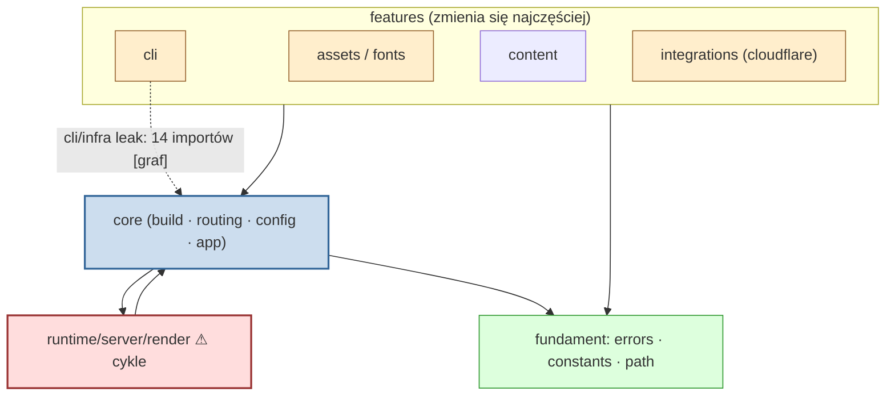

# Mapa projektu — withastro/astro (onboarding)

**Dla:** nowego developera wchodzącego w `packages/astro`. **Czas czytania:** ~15 min.
**Oznaczenia pochodzenia sprzężeń:** `[graf]` graf importów (dependency-cruiser) · `[git]` historia commitów (12 mies.) · `[regen]` sprzężenie przez regenerację/bumpy (tanie) · `[unknown]` poza zasięgiem narzędzia.

---

## 1. TL;DR

Astro to framework SSR (monorepo pnpm); cała grawitacja to **`packages/astro`** (~50% aktywności). System ma czytelną warstwowość: **fundament** (`core/errors`, `core/constants`, `core/path`) ← **`core`** (build, routing, config, render) ← **features** (`cli`, `assets`, `content`, `integrations`, `runtime`). Praca **potroiła się w 2026** i przesunęła z budowania feature'ów (H2 2025) na **testy i utwardzanie** (`core:test` 1109→2857 w 26Q1–Q2). Boli w dwóch miejscach: **render pipeline** (`runtime/server/render` — 49 cykli, nieizolowalny) `[graf]` oraz **kontrakt publiczny** (`types/public/config.ts`, `core/config`) — dotyka go każdy feature `[git+graf]`. Jeden plik-oś, `render-context.ts`, **został usunięty 2026-05-06** (#16366) i rozbity na architekturę handlerów — analizy sprzed tej daty są nieaktualne `[git]`. Wiedza jest **silnie skupiona**: `Florian Lefebvre` (CLI/fonts/config/errors) i `Matthew Phillips` (render).

---

## 2. Teren — gdzie żyje system

- **Duża odpowiedzialność:** `core/*` (build 255, app 190, routing 101, config 101, errors 92) `[git]` — i to samo potwierdza graf: `core/errors` + `core/constants` to najczęściej importowane moduły `[graf]`.
- **Peryferia (aktywne, ale izolowane):** `assets/fonts` (świeży feature, 378 zmian/rok, bez cykli), `cli` (gruby entry-point), integracje. Wysoka aktywność, niski blast radius `[git+graf]`.
- **Moduły głębokie** (wszyscy ich używają): `core/errors/index.ts` (75 importerów), `core/constants.ts` (69) `[graf]`.
- **Moduły płytkie** (cienkie wejścia, wysoki fan-out, nikt ich nie importuje): `core/create-vite.ts` (48), `cli/index.ts` (33) `[graf]`.
- **Aktywność w czasie:** H2 2025 = budowanie wszerz (fonts, cli, actions, language-tools); 2026 = jakość — eksplozja testów i odżycie `db`/`runtime` `[git]`.

---

## 3. Realne powiązania — co naprawdę zmienia się razem

- **`core` jest uniwersalnym ujściem** — niemal każdy obszar importuje do `core` (`cli→core` 41, `assets→core` 37, `content→core` 25) i `core` rozsyła z powrotem do `content`/`runtime`/`assets` `[graf]`.
- **Kontrakt config/typy = wspólny mianownik** — `types/public/config.ts` współzmienia się z całym repo, bo każdy feature dokłada opcję `[git]`; strukturalnie odpowiada mu `core/config/schemas/base.ts` `[graf]`.
- **Render to splot cykli** — `component.ts ↔ slot ↔ dom ↔ any ↔ server-islands` (49 cykli w `runtime/server/render`) `[graf]`.
- **„Wszystko + testy"** — najsilniejsza para historyczna (`core ↔ test`, 238) to **dyscyplina testów, nie struktura** — w 2026 brak testu w PR-ze rdzenia to anomalia `[git]`.
- **⚠ Sprzężenie przez regenerację (tanie):** `pnpm-lock.yaml`, `packages/astro/package.json`, `CHANGELOG.md`, wszystkie `examples/*/package.json` zmieniają się „ze wszystkim", ale **przez bumpy/release, nie ręczną edycję** `[regen]` — ignorować przy ocenie kosztu zmiany.

**Gdzie katalog ≠ rzeczywistość:**
- **`cli/infra/*` to nie CLI** — fizycznie pod `cli/`, ale importowane przez `core/dev`, `core/preview`, `vite-plugin-app` (14 importów) jako współdzielona warstwa infra `[graf]`. Refaktor „CLI" zepsuje serwer dev/preview.
- **`render-context.ts` już nie istnieje** — szukaj logiki w `core/*/handler.ts`, `core/app/prepare-response.ts`, `core/session/handler.ts` `[git]`.

---

## 4. Strefy ryzyka

| Strefa | Dlaczego niebezpieczna |
|--------|------------------------|
| `runtime/server/render` | 49 cykli — nie da się zmienić w izolacji; ryzyko regresji SSR `[graf]` |
| `core/errors` + `core/constants` | najwyższy in-degree (75/69) — zmiana promieniuje na całe repo `[graf]` |
| `types/public/config.ts` + `core/config` | publiczny kontrakt — łatwo o breaking change dla userów `[git+graf]` |
| `cli/infra/*` | przeciek warstw — „CLI" reużywane przez core; bus factor ≈ 1 `[graf]` |
| `core/build` (`create-vite`, `static-build`) | przekrojowe, wysoki fan-out — trudne do testu w izolacji `[graf]` |
| `assets/fonts` | świeży, wciąż ruchomy feature — API się stabilizuje `[git]` |

---

## 5. Kogo zapytać

| Strefa | Kontakt (temat) | Zapas |
|--------|------------------|-------|
| `cli/infra`, `assets/fonts`, `core/config`, `core/errors` | **Florian Lefebvre** — architekt DX/CLI, autor fontów i refaktoru CLI→DDD | Emanuele Stoppa |
| `runtime/server/render`, routing | **Matthew Phillips** — autor refaktoru handlerów (#16366) | Emanuele Stoppa |
| „cokolwiek, drugi kontakt" | **Emanuele Stoppa** — maintainer-generalista | — |

> ⚠ Skupienie wiedzy: dla `cli/infra` i `fonts` Florian to pojedynczy punkt — większe zmiany przez jego review.

---

## 6. Pierwszy dzień — co przeczytać (w tej kolejności)

1. **`core/constants.ts`** — stałe całego rdzenia; tani wstęp do słownika pojęć `[graf]`.
2. **`core/errors/index.ts`** — fasada błędów; #1 centrum, zrozumiesz jak rdzeń sygnalizuje problemy `[graf]`.
3. **`types/public/config.ts`** — publiczny kontrakt konfiguracji; „wspólny mianownik" repo `[git+graf]`.
4. **`core/create-vite.ts`** — główny punkt zszywania Vite; tu widać, jak rdzeń łączy warstwy `[graf]`.
5. **`core/routing/handler.ts`** + **`core/app/prepare-response.ts`** — następcy usuniętego `render-context.ts`; obecna architektura żądania `[git+graf]`.
6. **`runtime/server/render/component.ts`** — oś renderu i gniazda cykli; tu uważaj najbardziej `[graf]`.
7. **`cli/index.ts`** — entry-point CLI; jak spinane są komendy `[graf]`.
8. **`cli/infra/build-time-astro-version-provider.ts`** — przykład przecieku warstw (provider używany poza CLI) `[graf]`.

---

## 7. Ograniczenia — czego ta mapa NIE mówi

- **Okno:** tylko **ostatnie 12 miesięcy** (od 2025-06-28). Starsze decyzje i kod „zamrożony" są niewidoczne.
- **Metoda:** aktywność (`git log`) + graf importów statycznych. To **nie** jest mapa poprawności, wydajności ani logiki biznesowej.
- **Zakres grafu:** tylko `packages/astro/src` + `cloudflare`, **bez `tsConfig`** (importy względne) → aliasy i type-only mogą być niedoszacowane; **`.astro` poza grafem** `[unknown]`.
- **Cross-package (astro ↔ integracje):** w większości `[unknown]` — wymaga szerszego checkoutu.
- **Sieroty (50)** to głównie pliki typów — realna lista wymaga `tsConfig` + `tsPreCompilationDeps`.
- **Runtime dynamiczny** (lazy import, wtyczki Vite ładowane konfiguracją) nie jest w grafie statycznym `[unknown]`.
- Kontrybutorzy = autorstwo commitów; review/pair-programming i wiedza ustna są niewidoczne `[unknown]`.
